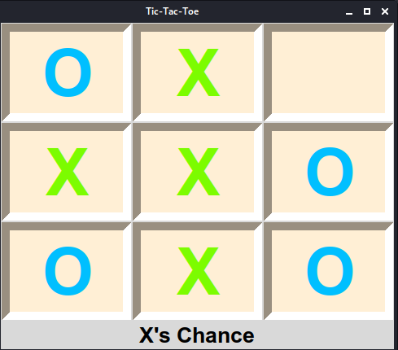
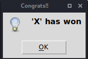

# Tic_Tac_Toe_Python
## A system with installed python will be fine for this project.
  ### In order to download python :
  1) [Download](https://www.python.org/downloads/ "Python downloads") ::For Windows
  2) For Linux   : It's already shipped with linux. "you can check the version by opening the terminal and typing "_python3 --version_""

### The following modules are used in this project:
   1)Random (No need to download this module for Linux as well as Windows as it is already there)
     2)Tkinter: No need to download for Windows
               For linux : Hit the command **sudo apt-get install python-tk**
### OUTPUT::::::

### After the game has ended::::::::

